# Basic Frontend Application with Docker and Kubernetes

## Setting up the project

Created a new project directory by doing a git clone and git init 

## Initialize Git

 Created an HTML and CSS file and then added a simple web application code in them using nano

 Added and commited initial code to Git repository

 ![gitcommit](img/4.gitcommit.png

## Dockerize the Application

Created a **Dockerfile** specifying Nginx as the base image 

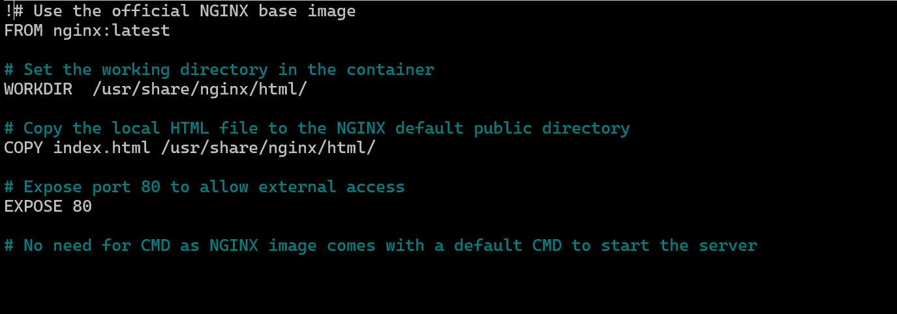

Copied the HTML and CSS files into the same directory as the dockerfile

## Push to Dockerhub    

 First, built an image from the dockerfile

 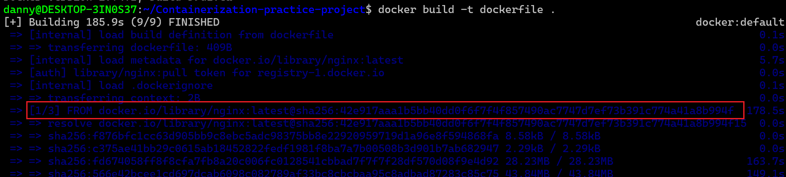

 Ensure Docker image is appropiately tagged 

 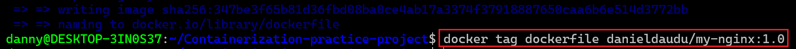

 Pushed image to docker hub

 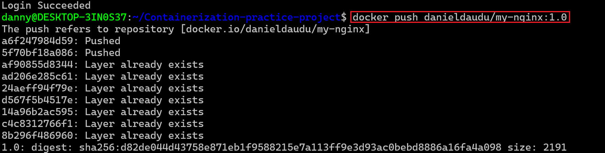

 ## Set up Kind Kubernetes Cluster 
 
 Kind was installed

 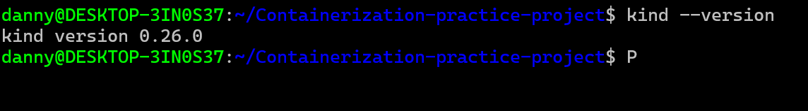

 Creating a Kind Cluster

 Note that docker and kind already installed. 

 Created a kind cluster running **kind create cluster**

 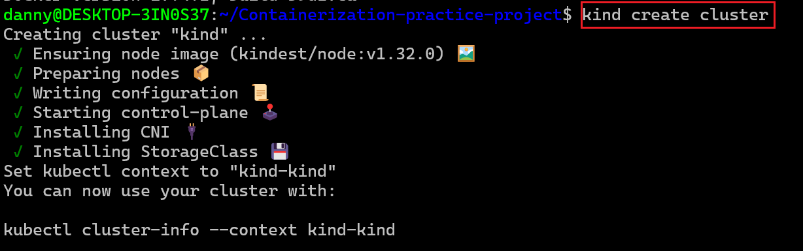

 This will create a Docker container for my Kubernetes control plain and set up default configuration for my cluster

 Verified the cluster 

 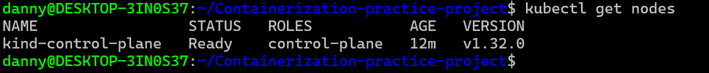

 
 ## Deploy to Kubernetes

 I created a Kubernetes Deployment YAML file specifying the image.

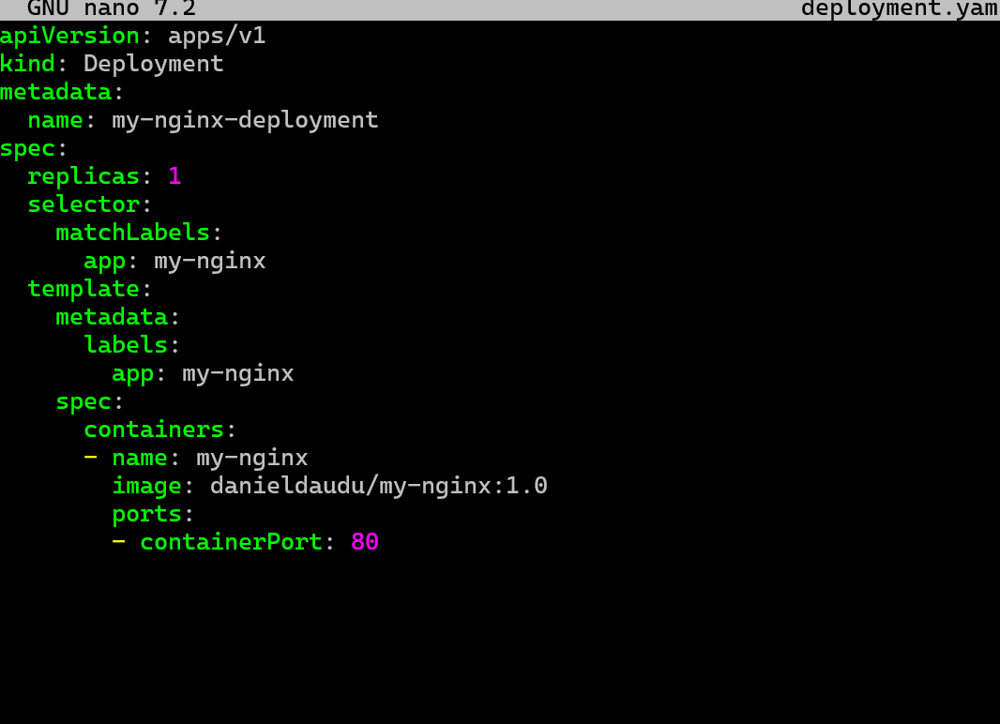

This yaml snippet defines a Kubernetes Deployment for deploying an instance of the Nginx web server. Let's break
down the key components:

apiVersion: apps/v1: Specifies the Kubernetes API version for the object being created, in this case, a Deployment in the "apps"
group.

kind: Deployment: Defines the type of Kubernetes resource being created, which is a Deployment. Deployments are used to
manage the deployment and scaling of applications.

metadata: Contains metadata for the Deployment, including the name of the Deployment, which is set to "my-nginx-
deplovment."

spec: Describes the desired state of the Deployment.

replicas: 1: Specifies that the desired number of replicas (instances) of the Pods controlled by this Deployment is 1.

selector: Defines how the Deployment selects which Pods to manage. In this case, it uses the label "app: my-nginx" to match
Pods.

template: Specifies the template for creating new Pods.

metadata: Contains labels for the Pods, and in this case, the label is set to "app: my-nginx."

spec: Describes the Pod specification.

 I then applied the deployment to my cluster by running **kubectl apply -f deployment.yaml**

 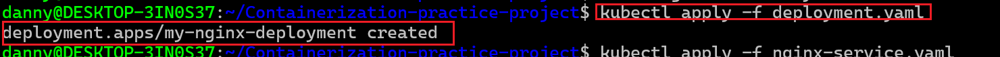

## Create a Service (ClusterIP)

I created a Kubernetes Service Yaml file specifying the type as ClusterIP

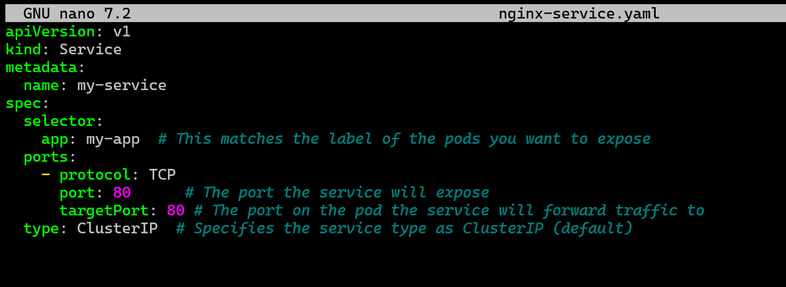

I then applied the service to my cluster 

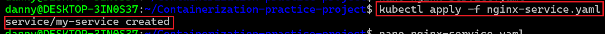

Verifying the deployment

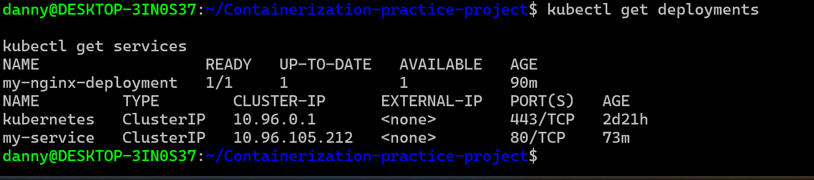

Accessing the application 

 I Port-forwarded to the service to access the application locally

 Opened browser and visited the specified port to view my simple frontend application 

 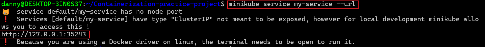

 

 