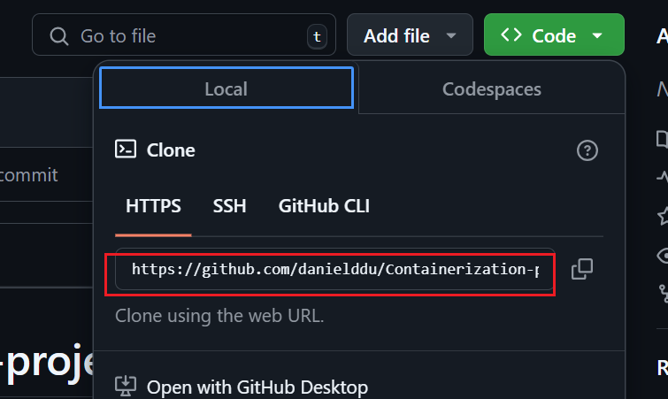
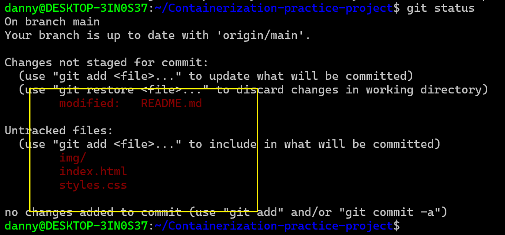

# Basic Frontend Application with Docker and Kubernetes

Created a new project directory by doing a git clone and git init 

 Created an HTML and CSS file and then added a simple web application code in them using nano

 Added and commited initial code to Git repository

 